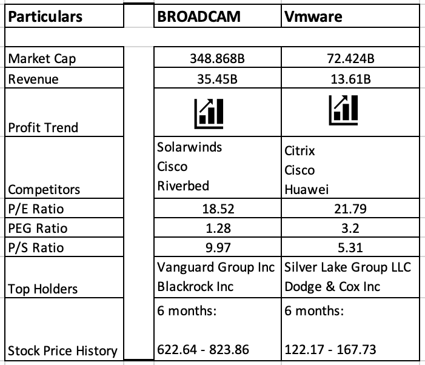
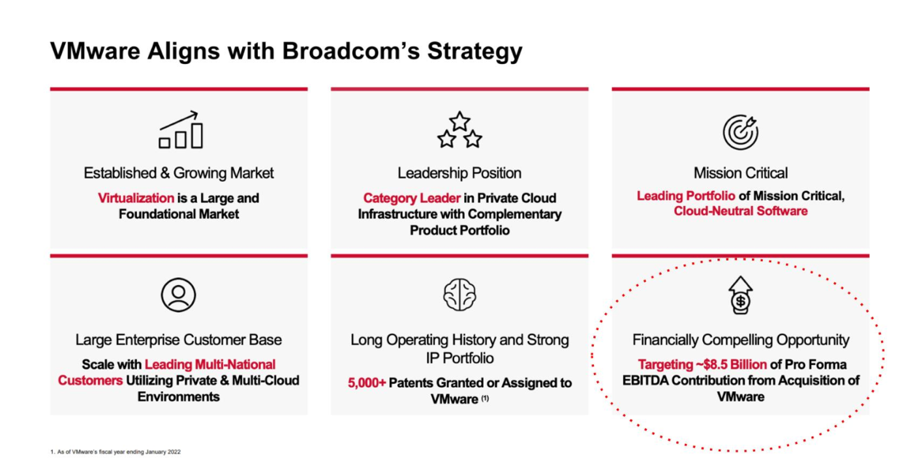
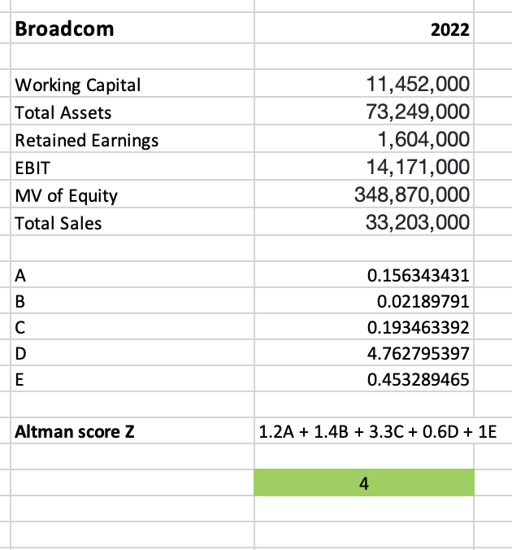
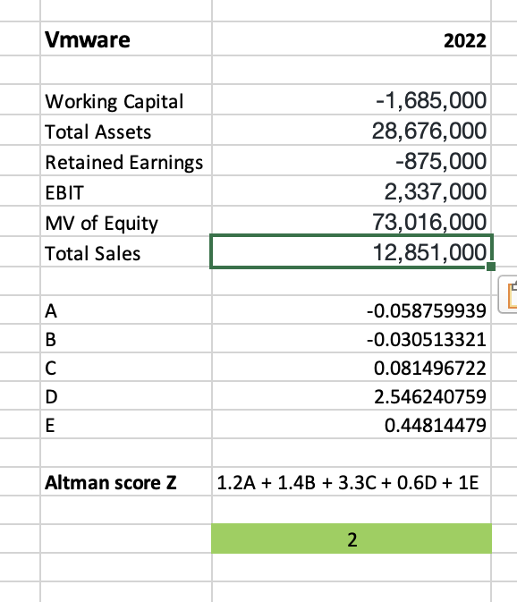

**A critical analysis of the concept of takeovers along with the
explanation of the different types of takeover strategies**

**1 Mergers and Acquisitions:**

Corporate strategies known as mergers and acquisitions (M&A) involve
combining two or more businesses. Businesses frequently employ these
tactics to accomplish a range of objectives, namely growth,
diversification, cost reduction, and market supremacy. A summary of
acquisitions and mergers is provided below.

**Mergers:**

A merger is an agreement that unites two or more businesses into one
new, cohesive entity. In a merger, the businesses involved often combine
their operations, liabilities, and assets to produce a stronger, more
aggressive company.

Based on the characteristics of the combined entity, mergers can be
divided into several categories:

-   Horizontal: Companies that operate in a single sector and in the
    same step of the production cycle are involved in a horizontal
    merger. Consider the merger of two rival pharmaceutical firms.

-   Vertical merger: Involves businesses that are part of the same
    sector but are situated at various points along the supply chain.
    Take a merger of a tire and car company as an example.

-   Conglomerate merger: Involves organizations from unrelated
    industries. Take the combination of a technology company and a
    beverage or food company as an example.

**Acquisitions:**

When one business (the acquirer and buyer) buys the assets or stock of
another business (the target or seller), the transaction is referred to
as an acquisition, sometimes known as a takeover. Both friendly and
hostile acquisitions are possible. Management and the board of directors
of the target company approve the deal in a friendly acquisition. The
management of the target firm opposes the takeover in a hostile
purchase. Acquisitions can be full (purchasing the entire target firm)
or partial (purchasing a piece of the target company).

The motivations behind the acquisitions are mainly,

-   Synergy: Achieving synergy is one of its most frequent objectives
    since it can reduce costs and boost productivity and profitability.
    Benefits in terms of operations, finances, or strategy can all lead
    to synergy.

-   Market Expansion: Organizations can grow their markets, and customer
    bases, or access new distribution channels by acquiring or merging
    with other businesses.

-   Diversification: Businesses can lower risk and become less reliant
    on a particular market or product by purchasing businesses in many
    industries.

-   Technology and innovation: Businesses can stay competitive and speed
    up the development of their own products by acquiring firms with
    cutting-edge technology or inventive products.

-   Economies of Scale: In order to benefit from economies of scale,
    larger businesses may purchase smaller ones. This can lower
    manufacturing, shipping, and marketing expenses.

-   Vertical Integration: In order to have more control over the supply
    chain and distribution network, businesses may vertically merge by
    buying suppliers or consumers.

-   Positioning strategically: M&A can be used to improve a company\'s
    position in the market, get rid of rivals, or sabotage a rival\'s
    operations.

**2 Introduction:**

**2.1 Broadcom:**

A leader in worldwide technology, Broadcom Inc., a Delaware corporation
with headquarters in San Jose, California, creates, develops, and
provides a variety of semiconductor products and software for
infrastructure solutions. The crucial markets served by Broadcom\'s
category-leading product portfolio include data centers, networking,
programmed, broadband, wireless, storage, and industrial. We offer data
center networking and storage, mainframe and enterprise software with an
emphasis on automation, security, and monitoring, smartphone components,
telecoms, and industrial automation, among other things.
ReimaginingSoftware.com has information on the upcoming merger between
Broadcom and VMware.

**2.2 VMware:**

With facilities in Palo Alto, California, VMware, Inc. is a US-based
virtualization and cloud computing technology business. The x86
architecture was virtualized for the first time by a commercially
successful firm, VMware. Microsoft Linux, macOS, and Windows are all
supported by VMware\'s desktop software. On server hardware, VMware
ESXi, its business-oriented hypervisor, acts as an operating system.

**2.3 Drivers of Mergers and Acquisitions:**

Strategic Growth:

-   Expansion: To increase their market presence, businesses may
    undertake M&A to enter fresh regions or industries.

-   Diversification: Companies may purchase businesses in unrelated
    industries in an effort to diversify their portfolio of companies
    and lower risk.

-   Market share: Gaining a higher market share and a competitive edge
    can be accomplished through acquiring rivals or similar firms.

Synergy:

-   Cost Synergy: By leveraging economies of size, streamlining
    procedures, and lowering costs, combining operations can result in
    cost savings.

-   Revenue Synergy: Mergers and acquisitions (M&A) can lead to chances
    for upselling, cross-selling, and customer base growth.

Financial considerations:

-   Improved Financial Performance: Mergers can increase financial
    indicators like profits per share (EPS) as well as return on
    investment (ROI), among others.

-   Access to funding: Businesses with sound financial standing may buy
    others who need funding or have significant assets.

-   Tax advantages: M&A transactions can be set up to benefit from tax
    breaks or better tax treatment.

Industry Dynamics:

-   Competitive Pressures: In order to maintain their positions,
    businesses may be forced to merge or acquire when the competitive
    environment changes.

-   Industry Trends: M&A may be used to address industry trends like
    globalization, digitization, or regulatory changes.

Operating Effectiveness:

-   Streamlining procedures: Combining related procedures can reduce
    duplication and boost overall effectiveness.

-   Benefits of Scale: Larger businesses may have economies of scale,
    which lowers expenses per unit.

Risk Reduction:

-   Diversification: M&A can assist in reducing risks related to
    dependence on one good, market, or client.

-   Defensive moves: One way to defend market share is by buying out or
    merging with possible rivals or threats.

Regulatory and geopolitical factors:

-   Governmental policies: Governmental policies can have an impact on
    merger and acquisition activity.

-   National or regional strategies: Businesses may engage in M&A to
    support aims for regional or national economic development.

**3 Due Diligence**:

To ensure that a party does not become legally responsible for any harm
or loss, due diligence is the process or effort of gathering and
analyzing information prior to making a choice or carrying out a
transaction. The phrase is used in a variety of contexts, notably
economic transactions.

{width="4.861111111111111in"
height="4.180555555555555in"}

Broadcom has an astonishing track record of acquisitions and mergers,
including those of LSI, Symantec, Emulex, Computer Associates, and
dozens of other companies, each of which was steered by Chief Executive
Hock Tan. The corporation seeks competitors with a lasting competitive
advantage, devoted installed bases, and demonstrated and dependable
operational histories, as demonstrated in the Broadcom slide above.
According to the emphasized bottom right edge, Broadcom expects VMware
to provide \$8.5 billion annual EBITDA after the acquisition.

He has frequently said comments like \"We don\'t directly compete in
CPUs\... basically, we don\'t play in matches we can\'t win.\" He has
also outlined the foundation of VMware, which is a multi-cloud strategy
for clients who must or prefer to have some of their data remain
on-premises. In the sentence above, trump uses the expression
\"sovereign cloud,\" which is a pun on \"data sovereignty.\"

Last but not least, the ecosystem\'s significance in enhancing VMware\'s
value proposition and offering alternatives to the general public cloud
is acknowledged. It\'s evident that Hock Tan appreciates and comprehends
the VMware ecosystem.

The VMware purchase was expected by VMware Explore. Broadcom has stated
that it will cease operations by the end of this fiscal year, which ends
in October, though it may be postponed to the next one.

{width="6.268055555555556in"
height="3.1993055555555556in"}

The opinions of the analysts on Broadcom\'s purchase of VMware are
summarized here. The purchase is notable for a number of reasons:

**3.1 Nature of Acquisition**:

VMware isn\'t just another software maker. It is a mainstay of business
technology that is used everywhere & brings in a lot of money. While
VMware and prior Broadcom software acquisitions have traits such as a
devoted installed base and a steady stream of updates, VMware is very
different from earlier purchases.

-   Historical comparison: Historically Speaking Many of Broadcom\'s
    prior acquisitions were assumed to belong to aging companies. This
    viewpoint might hold true for the virtualization sector, but VMware
    is set to experience new growth, especially with the introduction of
    multi-cloud.

-   Strategic position: In comparison to Broadcom\'s prior software
    purchases, we believe VMware is well-positioned to tackle the
    complexity across many clouds because it has considerable growth
    potential.

-   Post-acquisition scenario: Broadcom intends to merge its current
    software division with VMware, essentially building a corporation
    with multiple chip design divisions and a separate software
    division.

-   Rationalizing software stack: Combining the software stack presents
    the true commercial opportunity for Broadcom. Our assumption is that
    Broadcom will concentrate its development and research efforts on a
    path that is appealing to consumers and can clearly create money
    after VMware becomes the primary software asset.

**3.2 Investment strategy taken by Broadcom**:

In our opinion, Broadcom will concentrate more on R&D than VMware. Based
on our observations of Hock Tan, we think that

Investment approach: According to Broadcom\'s strategy, it is important
to find businesses with a \"moat\" or competitive advantage and provide
them with sufficient yet targeted R&D resources. Making the company\'s
case for consumers to stay on the platform more compelling than leaving
and running the risk and financial risk of transferring is the goal.

Broadcom\'s acquisition of VMware represents a strategic expansion of
its investment strategy to include other software acquisitions. We
don\'t think Broadcom is necessarily aiming for a certain revenue mix
from semiconductors and software; instead, we think it\'s seeking solid
companies that match its business strategy. With an opportunity for
expansion and competitive posture in the multi-cloud market, VMware
could play a key role in the future of Broadcom. How Broadcom will
consolidate and improve its extensive software portfolio after the
acquisition still poses a difficulty.

**3.3 Operational strategy of Broadcom:**

Autonomy: Broadcom\'s strategy will maintain VMware as a distinct
business section that is able to thrive on its own. A business unit is
rarely if ever, permitted by Broadcom to rely upon other facets of its
operations. Instead, it demands that a business unit operate
independently and effectively without support from other divisions.

Streamlining headcount: It is almost inevitable that Broadcom will do
so. The usual technology company uses marketing to advertise its
products, but Broadcom is cautious with its spending.

Broadcom might be able to provide VMware customers with better prices
for growing their business volume. More money will get you a better
bargain.

**3.4 Altman Score:**

Determining a company\'s likelihood of insolvency is the Altman Z score.
For businesses with the greatest bankruptcy risk, the Altman Z score is
often around -0.25. On the other hand, the Altman Z score may increase
to +4.48 for businesses with the lowest likelihood of insolvency.

3.4.1 Altman Score for Broadcom (Parent Company):

{width="4.375in" height="4.694444444444445in"}

As you can see the company is getting a score of 4 which is a good sign
and the company is not have any chance of going bankrupt in the near
future. Companies working capital is well maintained and retained
earnings also constantly maintained which is a good sign for the
acquiring firm.

3.4.2 Altman Score of VMware (acquired firm):

{width="4.013888888888889in"
height="4.666666666666667in"}

As you can see the company is getting a score of 2 which is a neutral
sign and the company may or may not have the chance of going bankrupt in
the near future. Companies working capital is not properly maintained
and retained earnings also in negative which is a not a positive sign
for the acquired firm. Without proper management and allocation of
capital the company has a high chance of going bankrupt.

**4 T****akeovers:**

Takeovers, sometimes referred to as purchases or buyouts, occur when one
business buys a sizable portion of another\'s stock or assets. Takeovers
are characterized by a number of takeover significant concepts and
expressions, including.

-   Acquirer or Buyer: The business or entity that begins and completes
    the acquisition by purchasing the shares or other assets of the
    company being targeted is known as the acquirer or buyer.

-   Target Company: The organization that is the target of the takeover
    & whose stock or assets the acquirer wants to buy.

-   Tender Offer: A public offer presented by the buyer to the target
    company\'s shareholders to buy the shares they own at a set price
    within a set time frame is known as a tender offer.

-   Acquisition vs. Merger: In some takeover situations, two companies
    merge to form a single new business (merger of equals), whereas, in
    other situations, one company gets taken over by the target company
    (acquisition). The terminology used will vary depending on the
    transaction\'s nature.

-   Due Diligence: Prior to completing the takeover, the acquirer
    performs a thorough investigation and analysis to evaluate the
    target company\'s financial, operational, legal, and regulatory
    elements. This process is known as due diligence.

-   Share Purchase vs. Asset Purchase: In a share buying, the buyer
    purchases the target company\'s ownership (shares), along with all
    of its financial obligations and assets. In asset buying, the buyer
    purchases certain liabilities and assets of the target firm but not
    the target company\'s ownership.

-   Premium: The amount offered by the acquirer above the going market
    rate per share and per asset unit to persuade shareholders or other
    interested parties to support the takeover.

-   Synergy: The potential gains that the acquirer anticipates from
    merging its operations and those of the company being acquired, such
    as reduced expenses, enhanced efficiency, or revenue growth.

-   Anti-Takeover Measures: Defensive tactics used by the management of
    the target company to thwart or thwart hostile takeovers. These can
    feature staggered boards, golden parachutes, and lethal pills.

-   Regulatory Approvals: To make sure that takeovers don\'t hurt
    competition or break antitrust rules, many acquisitions need
    regulatory permission from government organizations.

-   Proxy Fight: A tactic used by hostile takeover bidders to persuade a
    goal company\'s shareholders to approve the purchase by appointing
    new board members who are in favor of the buyout.

-   Leveraged buyout (LBO): a kind of takeover in which a business is
    purchased using a sizable amount of borrowed money, frequently with
    the target company\'s assets acting as security.

-   White Knight: Defending the best interests of the acquired firm and
    its shareholders by intervening in the takeover process as a White
    Knight to oppose a hostile takeover proposal.

**4.1 Takeover Strategies:**

Depending on the objectives, drivers, and techniques used by the
acquiring organization, acquisition strategies could vary considerably.
Following are a few typical takeover tactics:

-   Friendly Takeover: In a friendly merger, the management & board of
    directors of the target company and the acquiring company are in
    accord and actively work to smooth the acquisition. The purchase is
    often authorized by the target company\'s management, who may even
    suggest it to shareholders.

-   Hostile Takeover: In a hostile acquisition, the buyer\'s company
    aims to take over the target business without the management or
    board of directors\' cooperation or approval. A hostile takeover may
    employ strategies including a tender offer made directly to
    shareholders, the proxy battle to remove the target\'s board, or the
    acquisition of a sizable number of shares to increase one\'s power.

<!-- -->

-   Cash offer: In a cash acquisition, the buyer makes an offer to buy
    the target company\'s stockholders\' shares for a certain amount of
    cash per share. The stockholders of the target could receive instant
    liquidity thanks to this method.

-   Stock Offer: In a stock takeover, a buyer offers its very own shares
    in return for the shares of the target company. Investors in the
    target company transfer their shares to the acquiring company.

-   Merger of Equals: A merger of equality occurs when two businesses
    with comparable size and power join to form a new, combined
    organization. Since both businesses contribute evenly to the new
    organization, this technique is frequently viewed to be a merger
    instead of an acquisition.

-   Back-End Fusion: In a back-end merger, the buyer initially buys the
    target company for a majority stake before later integrating the
    target into its current operations. The target business now exists
    as a distinct entity.

-   Asset Acquisition: In asset buying, the buyer\'s business does not
    actually purchase the target company; rather, it purchases certain
    liabilities and assets from the target company. By employing this
    tactic, the acquiring corporation is able to pick the required
    assets while avoiding undesirable liabilities.

<!-- -->

-   Cross-Border Invasion: Companies from several nations participate in
    cross-border acquisitions. Typically, the target & buying business
    has different home countries. Additional regulatory & cultural
    considerations may apply to these takeovers.

**5 Conclusion:**

The main motive of Broadcom to acquire VMware is to expand its range of
sales and growth, Both the companies are from the same sector and for
Broadcom VMware aligns in their strategy. Broadcom used Horizontal
merger with stock compensations and cash payments which is a good
approach. In my analysis I came to know that the company has performed
many due diligences process before acquiring VMware. According to
Broadcom\'s strategy, it is important to find businesses with a \"moat\"
or competitive advantage and provide them with sufficient yet targeted
R&D resources. Broadcom\'s acquisition of VMware represents a strategic
expansion of its investment strategy to include other software
acquisitions. I don\'t think Broadcom is necessarily aiming for a
certain revenue mix from semiconductors and software; instead, I think
it\'s seeking solid companies that match its business strategy. With an
opportunity for expansion and competitive posture in the multi-cloud
market, VMware could play a key role in the future of Broadcom, with the
acquisition of VMware, Broadcom has the goal of developing solutions
that would enable businesses to freely migrate their application
payloads across private, public, & hybrid cloud environments.

The Altman score of Broadcom (The Acquiring company) is 4 on comparing
with the VMware firm (The Acquired company) which is 2. This shows that
Broadcom has good financial management and they don't have any chance on
going bankrupt in the near future and in the other hand the VMware have
a week financial management system and their financial are not properly
utilized which may result to the closing of the firm.

This Merger is an essential process for both the companies to sustain
and grow in the market. This merger has resulted the Broadcom to expand
its market reach and reducing the cost of receivables wherein VMware's
case this merger has helped the company to raise the capital which the
company is in need of and it also boosted their performance by 4% on
revenue and 280% on retained earnings form year 2022 -- 2023.

**6 References:**

Marks, M.L. and Mirvis, P.H., 2011. Merge ahead: A research agenda to
increase merger and acquisition success. Journal of business and
psychology, 26, pp.161-168.

Seo, M.G. and Hill, N.S., 2005. Understanding the human side of merger
and acquisition: An integrative framework. The Journal of Applied
Behavioral Science, 41(4), pp.422-443.

Stein, J.C., 1988. Takeover threats and managerial myopia. Journal of
political economy, 96(1), pp.61-80.

Powell, R.G., 1997. Modelling takeover likelihood. Journal of Business
Finance & Accounting, 24(7‐8), pp.1009-1030.

Denison, D.R. and Ko, I., 2016. Cultural due diligence in mergers and
acquisitions. In Advances in mergers and acquisitions (pp. 53-72).
Emerald Group Publishing Limited.

Harvey, M. and Lusch, R.F., 1998. Beyond traditional due diligence for
mergers and acquisitons in the 21st century. Review of Business, 19(3),
p.17.
